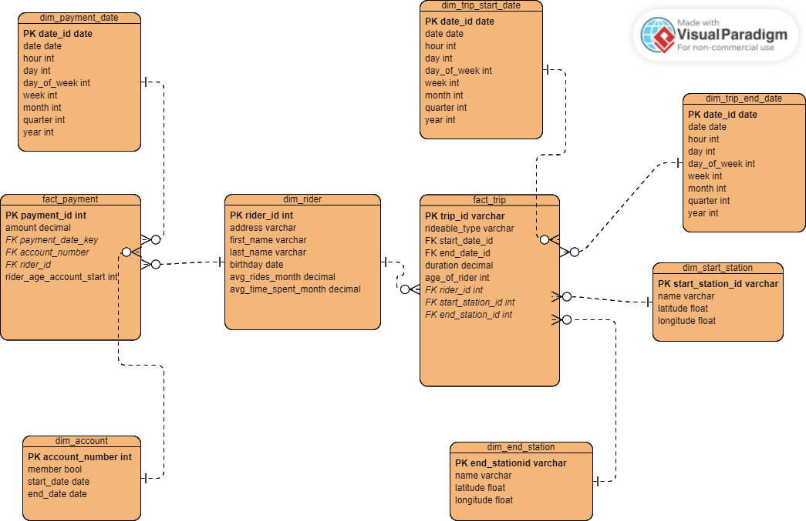

# Azure Data Warehouse for Divvy
Divvy is a bike sharing program in Chicago. As part of Udacity's nanodegree on Data Engineering with Microsoft Azure, we developed a dimensional data model for Divvy and set up an ETL pipeline to extract, transform and load Divvy's data into an Azure Synapse data warehouse.

## Project
The aim of the project was to implement a data warehouse solution for Divvy's data with Azure Synapse Analytics.
### Business Requirements
The given business requirements were as follows:
1. Analyze how much time is spent per ride

    - Based on date and time factors such as day of week and time of day
    - Based on which station is the starting and / or ending station
    - Based on age of the rider at time of the ride
    - Based on whether the rider is a member or a casual rider
2. Analyze how much money is spent
    - Per month, quarter, year
    - Per member, based on the age of the rider at account start
3. Analyze how much money is spent per member
    - Based on how many rides the rider averages per month
    - Based on how many minutes the rider spends on a bike per month

## Approach
0. Develop a dimensional model to fit Divvy's BI needs
1. Extract Divvy's data from a Postgres database on Azure into an Azure blob storage.
2. Load the data into Azure Synapse workspace
3. Transform the data into the designed data model with Transact-SQL

The scripts used to load and transform the data can be found in the ``scripts`` folder.

Designed data model:

## Data
> Divvy  is a bike sharing program in Chicago, Illinois USA that allows riders to purchase a pass at a kiosk or use a mobile application to unlock a bike at stations around the city and use the bike for a specified amount of time. The bikes can be returned to the same station or to another station. The City of Chicago makes the anonymized bike trip data publicly available for projects like this where we can analyze the data.  
&mdash; Udacity

Below, you can find the an ERD of the initial data model.

